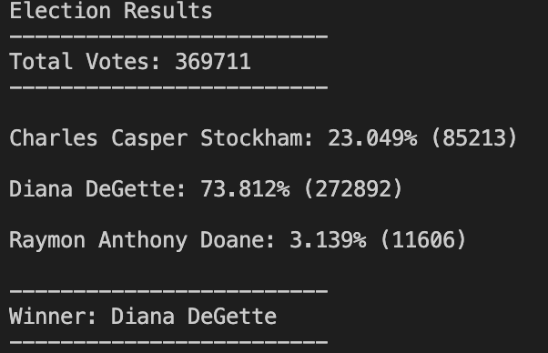

# python-challenge

This is the python-challenge submission for Joe Portnoy.

## Background

The goal of this project is to successfully write a Python script for two challenges, **PyBank** and **PyPoll**.

### PyBank
I was tasked to create a Python script to analyze the financial records of my company.

The files can be found in the ["PyBank" folder](PyBank).

I was provided with a dataset called budget_data.csv that include two columns of data titled, "Date" and "Profits/Losses."

I create a script to do the following:

- The total number of months included in the dataset

- The net total amount of "Profit/Losses" over the entire period

- The changes in "Profit/Losses" over the entire period, and then the average of those changes

- The greatest increase in profits (date and amount) over the entire period

- The greatest decrease in profits (date and amount) over the entire period

My script produced the following results:

The script also writes a txt file with the results as the output. The file is located in the ["analysis" folder](PyBank/analysis/budget_analysis.txt).

### PyPoll

For **PyPoll**, I was tasked to help a small, rural town modernize its vote-counting process.

The files can be found in the ["PyPoll" folder](PyPoll).

The dataset provided was called election_data.csv and had three columns labeled "Voter_ID", "County", and "Candidate.

I created a Python script that analyzed the data and calculated the following:

- The total number of votes cast

- A complete list of candidates who received votes

- The percentage of votes each candidate won

- The total number of votes each candidate won

- The winner of the election based on popular vote

The script prints the following results in the terminal:

The script also writes a txt file with these results in the ["analysis" folder](PyPoll/analysis/election_analysis.txt).